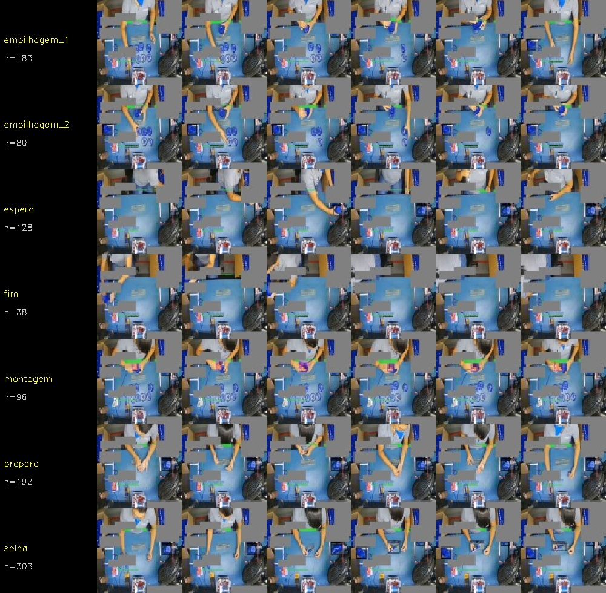
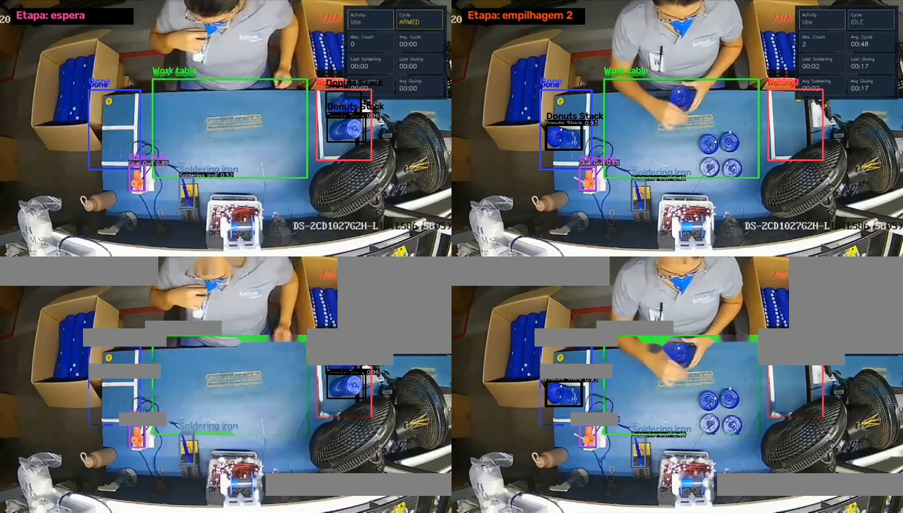

# AssemblyGuard




**Monitoramento embarcado da montagem do Bloq Volt com visão computacional e TinyML.**

Detecção de objetos em tempo real, validação da sequência por zonas e rastreabilidade local.

[](https://www.arduino.cc/)
[](https://www.python.org/)
[](https://opencv.org/)
[](https://www.edgeimpulse.com/)


> **Página principal:** [abrir o AssemblyGuard no GitHub Pages](https://bottomup.com.br/wp-content/ghss-static-sites/site-ceac2fd1-c427-4f30-8096-f4ca81a9d61c/docs/arvore-processos.html)

O AssemblyGuard usa um **XIAO ESP32S3 Sense** para executar um modelo FOMO
treinado no Edge Impulse sobre os frames da câmera. Os centroides detectados
(`peca`, `pilha` e `ferro_solda`) são classificados por zonas da bancada e
alimentam uma máquina de estados: `espera → preparo → montagem → solda →
empilhagem → fim`. Desvios são sinalizados no Serial/LED, salvos como JPEG e
registrados em CSV no microSD. Um painel web local exibe vídeo, zonas,
detecções e estado sem depender de nuvem durante a operação.

> **Contexto:** projeto do curso IESTI01 — TinyML, com mentoria do Prof. Marcelo
> Rovai e desenvolvimento na Bottomup Engenharia.

## Visão geral



### Árvore interativa

Abra a [árvore de processos](https://bottomup.com.br/wp-content/ghss-static-sites/site-ceac2fd1-c427-4f30-8096-f4ca81a9d61c/docs/arvore-processos.html)
ou a [versão local no repositório](docs/arvore-processos.html) para navegar pelo
fluxo completo do projeto. A página permite buscar por etapa ou arquivo,
selecionar cada fase e abrir diretamente o código e os guias relacionados.
Os textos, métricas, status e links da árvore ficam centralizados em
[arvore-processos.json](docs/arvore-processos.json); edite esse arquivo para
atualizar o conteúdo sem alterar o layout.

Para testar localmente com o JSON carregado:

```bash
python -m http.server 8000
```

Depois acesse `http://localhost:8000/docs/arvore-processos.html`.

### Publicar no GitHub Pages

O arquivo [index.html](index.html) é a entrada principal do site e encaminha
para a árvore interativa. O workflow
[pages.yml](.github/workflows/pages.yml) publica automaticamente o repositório
quando houver push para `marco`, `main` ou `master`.

Na primeira publicação, confirme no GitHub:

1. Abra **Settings → Pages**.
2. Em **Build and deployment → Source**, selecione **GitHub Actions**.
3. Envie as alterações para a branch `marco`:

```bash
git add README.md index.html docs/arvore-processos.html docs/arvore-processos.json docs/assets .github/workflows/pages.yml
git commit -m "Publicar arvore interativa no GitHub Pages"
git push origin marco
```

Após o workflow terminar, a página estará em
`https://bottomup.com.br/wp-content/ghss-static-sites/site-ceac2fd1-c427-4f30-8096-f4ca81a9d61c/docs/arvore-processos.html`.

| Camada | Responsabilidade | Entrada / saída |
| --- | --- | --- |
| **Preparação** | Inspecionar vídeos, remover overlays e extrair frames | vídeos → dataset 320×240 |
| **Anotação e treino** | Revisar caixas no Edge Impulse e treinar FOMO | imagens → modelo int8/EON |
| **Validação no PC** | Testar inferência e a lógica de estados antes do hardware | vídeo/RTSP/webcam → CSV + overlay |
| **Firmware** | Inferir na câmera, validar sequência e registrar evidências | OV2640 → Serial, web, SD |

## Resultado atual

| Indicador | Situação |
| --- | --- |
| Dataset V2 | 200 frames: 140 para treino (sessão C) e 60 para teste (sessão B) |
| Modelo | FOMO 96×96, grayscale, int8 + EON, export Arduino |
| Hardware | XIAO ESP32S3 Sense, OV2640, PSRAM OPI e microSD FAT32 |
| Desempenho observado | aproximadamente 143 ms por inferência, cerca de 4 fps |
| Monitoramento | Access Point `AssemblyGuard`, painel em `http://192.168.4.1` |
| Limitação conhecida | a revisão humana das caixas e a validação de pelo menos 10 ciclos ainda são etapas de qualidade |

## Comece aqui

1. Leia [LEIA-ME_PRIMEIRO.md](LEIA-ME_PRIMEIRO.md) para histórico, decisões,
   pendências e transferência do projeto para outro computador.
2. Consulte [docs/GUIA_EDGE_IMPULSE.md](docs/GUIA_EDGE_IMPULSE.md) para treino,
   exportação e gravação do firmware.
3. Veja [docs/GUIA_ESTAGIARIA.md](docs/GUIA_ESTAGIARIA.md) para revisão das
   anotações e retreino.
4. Consulte o [catálogo de funções](docs/funcoes/README.md) para entender cada
   função e método do código-fonte.

## Executar

### Validação no PC

Instale as dependências:

```bash
python -m pip install opencv-python numpy tensorflow
```

Execute sobre um vídeo:

```bash
python scripts/assemblyguard_pc.py \
  --source "videos/WhatsApp Video 2026-08-12 at 15.43.32.mp4" \
  --model modelo_assemblyguard_int8.tflite
```

Também são aceitos uma URL RTSP ou webcam (`--source 0`). Use `q` para sair,
`p` para pausar e `s` para salvar uma captura.

### Preparar o dataset V2

Os caminhos dos vídeos estão configurados nos dicionários `VIDEOS` dos scripts.
Ajuste-os para a sua máquina antes de executar:

```bash
python scripts/inspecionar_videos.py
python scripts/pipeline_deteccao.py --preview
python scripts/pipeline_deteccao.py
python scripts/gerar_preanotacao.py
```

O `--preview` deve ser conferido antes da extração. Depois, revise as caixas
geradas no Edge Impulse; a pré-anotação é um ponto de partida, não ground truth.

### Gravar e monitorar o XIAO

1. No Arduino IDE, instale o core **esp32 2.0.17** e selecione
   **XIAO_ESP32S3** com **PSRAM: OPI PSRAM**.
2. Adicione a biblioteca Arduino exportada pelo Edge Impulse em `modelos/`.
3. Abra `AssemblyGuard_XIAO/AssemblyGuard_XIAO.ino` e faça o upload.
4. Abra o Serial Monitor em **115200 baud**.
5. Conecte-se ao Wi-Fi `AssemblyGuard` com a senha `bloqvolt123` e acesse
   `http://192.168.4.1`.

O firmware usa a rede em modo Access Point por padrão. Para usar a rede local,
preencha `WIFI_STA_SSID` e `WIFI_STA_PASS` no sketch.

## Estrutura do repositório

| Caminho | Conteúdo |
| --- | --- |
| [AssemblyGuard_XIAO/](AssemblyGuard_XIAO/) | Firmware do ESP32S3: câmera, FOMO, estados, SD e painel web |
| [scripts/](scripts/) | Pipelines Python, inspeção de vídeos, pré-anotação e inferência no PC |
| [docs/](docs/) | Guias, plano técnico e referência das funções |
| [anotar/](anotar/) | Frames 320×240, amostras, previews e metadados do dataset |
| [modelos/](modelos/) | Exports do Edge Impulse para Arduino |
| [evidencias/](evidencias/) | Folhas de contato e comparativos usados nas decisões |
| [historico_v1/](historico_v1/) | Pipeline antigo de classificação, mantido como baseline |
| [videos/](videos/) | Vídeos de origem usados na preparação do dataset |

## Decisões técnicas importantes

- O split é por **sessão e operador**, não aleatório por frame: treino = C,
  teste = B. Isso reduz vazamento temporal e mede generalização real.
- A V2 detecta objetos, enquanto a V1 classificava cenas por OCR. A V1 foi
  preservada em `pipeline_assemblyguard.py` para comparação histórica.
- O estado só avança após três leituras consecutivas e não regride. Uma etapa
  pulada gera alerta, mas não bloqueia o fechamento do ciclo.
- `aplicador_cola` aparece na interface e pode ser anotado no modelo futuro,
  porém ainda não é usado como transição na máquina de estados atual.

## Documentação complementar

- [Árvore interativa de processos](docs/arvore-processos.html)
- [Logo vetorial do projeto](docs/assets/assemblyguard-logo.svg)
- [Plano V2 e critérios de sucesso](docs/PLANO_V2_DETECCAO.md)
- [Preparação histórica do dataset V1](docs/DOCUMENTACAO_PREPARACAO_DATASET.md)
- [Guia completo do Edge Impulse](docs/GUIA_EDGE_IMPULSE.md)
- [Catálogo de todas as funções](docs/funcoes/README.md)

## Licença e uso

Este repositório é um protótipo acadêmico/industrial em evolução. Antes de
usar em produção, valide iluminação, posição da câmera, classes anotadas,
latência, taxa de falsos alertas e comportamento do microSD em ciclos longos.
